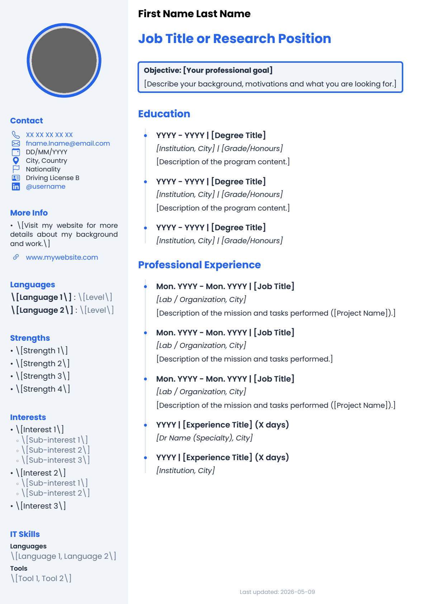

# CV Quarto Template

> A Quarto extension to generate a polished, two-column PDF résumé using Typst — fully configurable via YAML, no Typst knowledge required.


*Extension by [Valentin Goupille](https://www.valentingoupille.com) — free to use, modify and distribute under the [CC BY 4.0 License](LICENSE).*

---

## Preview



---

## Features

- **Two-column layout** — configurable sidebar (width, background, gutter) + main content area
- **Modular sidebar** — add, remove, and reorder sections entirely from YAML
- **Full theme system** — fonts, colors, and heading sizes all controlled via YAML
- **Timeline sections** — visual dot/line indicators for education and experience entries
- **SVG icons** — auto-colorized contact icons (phone, email, LinkedIn, GitHub, location…)
- **Colored inline links** — `[text](url){color="#hex"}` syntax in body content
- **Multi-column body** — side-by-side content blocks with `::: {.columns}`
- **Auto date** — `last-modified` or a fixed date with a customizable prefix
- **Auto-named PDF** — output automatically named `CV_FirstName_LastName_YYYY-MM-DD.pdf` via a post-render script

---

## Installation

**Option 1 — Full template** (recommended for a new CV):

```bash
quarto use template vgoupille/quarto-cv
```

This copies `template.qmd`, `assets/`, and installs the extension.

**Option 2 — Extension only** (add to an existing project):

```bash
quarto add vgoupille/quarto-cv
```

Then set `format: cv-typst: default` in your document frontmatter.

---

## Quick Start

```bash
quarto render template.qmd
```

This produces two files:

- `template.pdf` — always up-to-date preview (tracked in git)
- `CV_FirstName_LastName_YYYY-MM-DD.pdf` — the shareable export, named from the `author` field and today's date

The rename is handled automatically by `rename_output.py` via a `_quarto.yml` post-render hook — no manual step required.

---

## Preview Image Generation

The `assets/img/preview.png` shown above is generated from `template.pdf` using a small Python script (`convert_preview.py`). It uses [**uv**](https://docs.astral.sh/uv/) — a fast Python package manager — to run the script in an isolated environment without requiring any manual `pip install`.

The PDF rendering is handled by [`pypdfium2`](https://pypdfium2.readthedocs.io/), which bundles the PDFium engine directly in its Python wheel — **no system-level dependency required**.

**To regenerate the preview after updating your CV:**

```bash
# 1. Render the CV to PDF (also auto-generates CV_Name_Date.pdf)
quarto render template.qmd

# 2. Convert the first page to PNG
uv run convert_preview.py

# 3. Re-render the README
quarto render README.qmd
```

**Requirements:**

- [uv](https://docs.astral.sh/uv/getting-started/installation/) — install with `curl -LsSf https://astral.sh/uv/install.sh | sh`

The Python dependencies (`pypdfium2`, `pyyaml`) are declared in `pyproject.toml` and installed automatically by `uv run` on first use — no virtual environment setup needed.

---

## Complete YAML Reference

### Document Metadata

```yaml
title: "CV - First Name Last Name"
author: "First Last"              # used to name the output PDF
date: last-modified               # or a fixed date: "2026-01-01"
date-prefix: "Last updated: "    # leave "" to hide
```

The `author` field drives the automatic PDF filename: `CV_First_Last_YYYY-MM-DD.pdf`. If `date` is set to a specific ISO date (e.g. `2026-01-15`), that date is used; otherwise the render date is used.

---

### Sidebar Data

All contact fields are optional. Omit any field to hide it from the sidebar.

```yaml
sidebar:
  photo: "assets/img/photo.png"      # local path
  phone: "XX XX XX XX XX"
  email: "user@example.com"
  birthdate: "DD/MM/YYYY"
  city: "City, Country"
  nationality: "Nationality"
  permit: "Driving License B"
  website: "https://example.com"
  website-display: "My Website"      # optional custom label
  linkedin: "https://linkedin.com/in/username"
  linkedin-display: "\\@username"    # optional custom label
  github: "https://github.com/username"
  github-display: "\\@username"      # optional custom label
```

| Field | Type | Description |
|---|---|---|
| `photo` | path | Profile photo (local file) |
| `phone` | string | Phone number |
| `email` | string | Email address |
| `birthdate` | string | Date of birth |
| `city` | string | City, Country |
| `nationality` | string | Nationality |
| `permit` | string | Driving license |
| `website` | URL | Personal website |
| `website-display` | string | Custom label for the website link |
| `linkedin` | URL | LinkedIn profile URL |
| `linkedin-display` | string | Custom label (e.g. `\\@handle`) |
| `github` | URL | GitHub profile URL |
| `github-display` | string | Custom label (e.g. `\\@handle`) |

---

### Theme

```yaml
cv-theme:
  main-font: "Poppins"         # global font
  title-font: "Poppins"        # font for sidebar section titles
  text-font: "Poppins"         # font for sidebar body text

  sidebar:
    title-color: "#2563eb"     # section title color + photo border
    text-color: "#1e293b"      # main text color
    accent-color: "#64748b"    # secondary items color
    link-color: "#2563eb"      # link color

  main:
    title-color: "#2563eb"     # H1 color (section headings)
    subtitle-color: "#1e293b"  # H2 color (position, degree)
    text-color: "#1e293b"      # body text color
    # link-color: none         # leave unset to enable inline {color="..."} syntax

  headings:
    h1: 14pt     # section titles (Education, Experience…)
    h2: 11pt     # position / degree title
    h3: 10pt     # company / institution / dates
    normal: 10pt # body text
```

---

### Sidebar Defaults

Global spacing applied to all sidebar sections unless overridden per section.

```yaml
sidebar-defaults:
  text-size: 9pt
  title-size: 11pt
  icon-size: 11pt
  title-after: 1em     # space below the section title
  item-after: 1em      # space below each item
  section-after: 3em   # space below the entire section
```

---

### Sidebar Sections

The `sidebar-sections` list controls which sections appear and in what order. Each section has an `id`, an optional `title`, an `items` list, and an optional `style` block.

```yaml
sidebar-sections:
  - id: photo
  - id: contact
  - id: languages
  - id: strengths
  - id: interests
  - id: skills
```

#### Built-in section IDs

These IDs have pre-registered style slots in the template (useful for `sidebar-styles` overrides):

| ID | Purpose |
|---|---|
| `photo` | Profile photo (special renderer) |
| `contact` | Contact info items (`type:` items) |
| `networks` | Social links (`type:` items) |
| `languages` | Language / level pairs |
| `skills` | Skill categories |
| `strengths` | Plain text list |
| `interests` | Nested interest groups |

Any other `id` also works — it uses the generic renderer automatically.

#### Photo section

```yaml
- id: photo
  style:
    photo-size: 100pt
    photo-radius: 50%          # circular crop
    photo-border: true
    photo-border-width: 4pt
    section-before: 2em
    section-after: 3em
```

#### Item types

**`type:` — contact field** (pulls value from `sidebar:` data):

```yaml
items:
  - type: phone
  - type: email
  - type: birthdate
  - type: city
  - type: nationality
  - type: permit
  - type: website
  - type: linkedin
  - type: github
```

**`name` + `value` — key/value pair** (languages, certifications…):

```yaml
items:
  - name: "English"
    value: "Fluent"
  - name: "French"
    value: "Native"
```

**`name` + `subitems` — nested list** (interests, hobbies…):

```yaml
items:
  - name: "Sport"
    subitems:
      - "Running"
      - "Judo"
  - name: "Science"
    subitems:
      - "Genetics"
      - "AI & Health"
```

**`category` + `items` — inline category group** (IT skills…):

```yaml
items:
  - category: "Languages"
    items: "Python, R, Bash"
  - category: "Tools"
    items: "Git, Docker, HPC"
```

**Plain string — free text**:

```yaml
items:
  - "Visit my website for more details."
  - type: website
```

#### Per-section style overrides

Any section can override the global `sidebar-defaults` via a `style:` block:

```yaml
- id: contact
  title: "Contact"
  items:
    - type: phone
    - type: email
  style:
    item-after: 0em        # tighter spacing
    section-after: 3em
    title-size: 12pt
    text-size: 9pt
    icon-size: 10pt
    # icon-color: "#ff9500"  # override icon color for this section
```

---

### Layout

```yaml
cv-layout:
  sidebar-width: 30%       # left column width (%, cm, or fr)
  main-width: 2.5fr        # right column width
  gutter: 1cm              # space between columns
  sidebar-bg: "#f1f5f9"   # sidebar background color
  main-bg: "#ffffff"       # main area background color
  margins:
    top: 0.5cm
    bottom: 0.5cm
    left: 0.5cm
    right: 0.5cm
  timeline:
    dot-size: "2pt"
    line-width: "1pt"
    # dot-color: "#2563eb"   # optional color override
    # line-color: "#2563eb"  # optional color override
```

---

## Body Content

### Name & Title Block

At the top of the document, a raw Typst block sets the name and position:

````markdown
```{=typst}
#text(size: 14pt, weight: "bold", fill: rgb("#000000"))[First Name Last Name]
#v(0.15em)
#text(size: 18pt, weight: "bold", fill: rgb("#2563eb"))[Job Title or Research Position]
#v(0.5em)
```
````

### Highlight / Objective Block

A styled callout block for an objective or summary:

```markdown
::: {.block fill=rgb("#f1f5f9") inset="8pt" radius="4pt" stroke="2pt + rgb(\"#2563eb\")"}

**Objective:** Your professional goal here.

:::
```

### Timeline Sections

Wrap any section in `.timeline` to add dot/line indicators next to headings:

```markdown
# Education

::: {.timeline}

## YYYY – YYYY | Degree Title

*Institution, City | Grade*

Description of the program.

:::
```

**Heading level conventions inside `.timeline`:**

| Level | Purpose | Example |
|---|---|---|
| `#` (H1) | Section title | `# Education` |
| `##` (H2) | Entry title | `## MSc Bioinformatics` |
| `###` (H3) | Entry detail | `### University of X, 2024` |

### Colored Links

Use the `{color="..."}` attribute on any link in the body:

```markdown
See my [portfolio](https://example.com){color="#2563eb"} for more.
```

### Multi-column Body Content

```markdown
::: {.columns}

::: {.column width="50%"}
Left content here.
:::

::: {.column width="50%"}
Right content here.
:::

:::
```

---

## Lua Filters

Three Pandoc Lua filters run automatically during rendering and convert Quarto Markdown syntax into native Typst code.

---

### `timeline.lua`

Wraps `::: {.timeline}` divs into a `#timeline-section()` Typst call, which draws a vertical line with dots aligned to heading levels.

**Basic usage:**

```markdown
::: {.timeline}

## 2022 – 2024 | Position Title

*Organization, City*

Description of the role.

:::
```

**Advanced — restrict dots to specific heading levels:**

By default all heading levels (H1–H6) inside the block receive a dot. Use the `levels` attribute to target only certain levels:

```markdown
::: {.timeline levels="2,3"}

## Entry title          ← gets a dot
### Entry detail        ← gets a dot
#### Sub-detail         ← no dot

:::
```

**What the filter produces (Typst):**

```typst
#timeline-section(levels: (2,3,))[
  // your content
]
```

The `timeline-section` function and its dot/line styling are defined in `template.typ` and configurable via `cv-layout.timeline` in the YAML.

---

### `columns.lua`

Converts `::: {.columns}` / `::: {.column}` Quarto divs into a Typst `#grid()` call for side-by-side content.

**Usage:**

```markdown
::: {.columns}

::: {.column width="60%"}
Left content — takes 60% of the width.
:::

::: {.column width="40%"}
Right content — takes 40% of the width.
:::

:::
```

**Width formats accepted:**

| Value | Example | Converted to |
|---|---|---|
| Percentage | `width="40%"` | `0.4fr` |
| Fraction | `width="1fr"` | `1fr` |
| Omitted | — | `1fr` (default) |

**What the filter produces (Typst):**

```typst
#grid(
  columns: (0.6fr, 0.4fr),
  gutter: 1em,
  [ left content ],
  [ right content ]
)
```

---

### `colored-links.lua`

Adds a `{color="..."}` attribute to Markdown links to render them in a specific color in the PDF. Works only for Typst output — other formats (HTML, etc.) ignore the attribute and render a plain link.

**Usage:**

```markdown
See my [portfolio](https://example.com){color="#2563eb"} for details.
```

**What the filter produces (Typst):**

```typst
#text(fill: rgb("#2563eb"))[#link("https://example.com")[portfolio]]
```

Any valid CSS hex color works (`#rrggbb`). This is particularly useful to match link colors to your theme without setting a global `link-color` in `cv-theme`.

---

## Project Structure

```
your-cv/
├── template.qmd              # Your CV document (edit this)
├── _quarto.yml               # Project config — triggers post-render script
├── rename_output.py          # Post-render: copies template.pdf → CV_Name_Date.pdf
├── pyproject.toml            # Python deps (pypdfium2, pyyaml) for uv
├── convert_preview.py        # Converts template.pdf → assets/img/preview.png
├── assets/
│   └── img/
│       └── photo.png         # Your profile photo
├── _extensions/
│   └── cv/
│       ├── _extension.yml    # Extension metadata
│       ├── template.typ      # Typst layout engine
│       ├── brand.yml         # Color/typography presets
│       ├── columns.lua       # Multi-column Lua filter
│       ├── timeline.lua      # Timeline Lua filter
│       ├── colored-links.lua # Colored links Lua filter
│       └── icons/            # SVG contact icons (auto-colorized)
└── template.pdf              # Latest render (preview — tracked in git)
```

---

## Requirements

- [Quarto](https://quarto.org) ≥ 1.4
- Typst (bundled with Quarto ≥ 1.4, no separate install needed)

The fonts **Poppins** and **Inter** are bundled inside the extension — no system installation required. Any other font can be used by installing it on the system and setting `main-font` in `cv-theme`.

---

## Contributing

Contributions are welcome! Feel free to open an issue or submit a pull request for bug fixes, new features, or improvements.

```bash
# Fork the repo, then:
git clone https://github.com/your-username/quarto-cv.git
cd quarto-cv
quarto render template.qmd   # test your changes
```

This project is released under the [CC BY 4.0 License](LICENSE) — you are free to use, modify and distribute it, including for commercial purposes, as long as you credit the original author.
