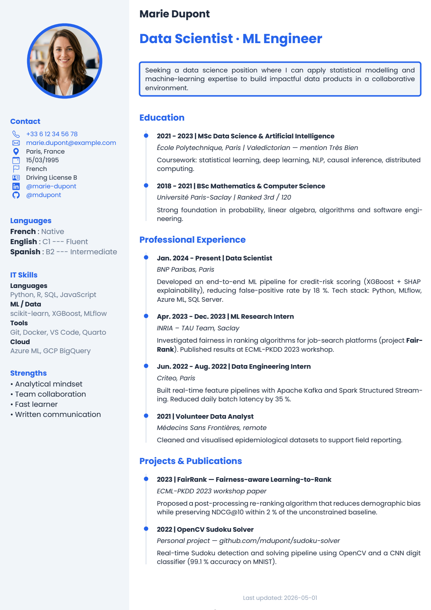
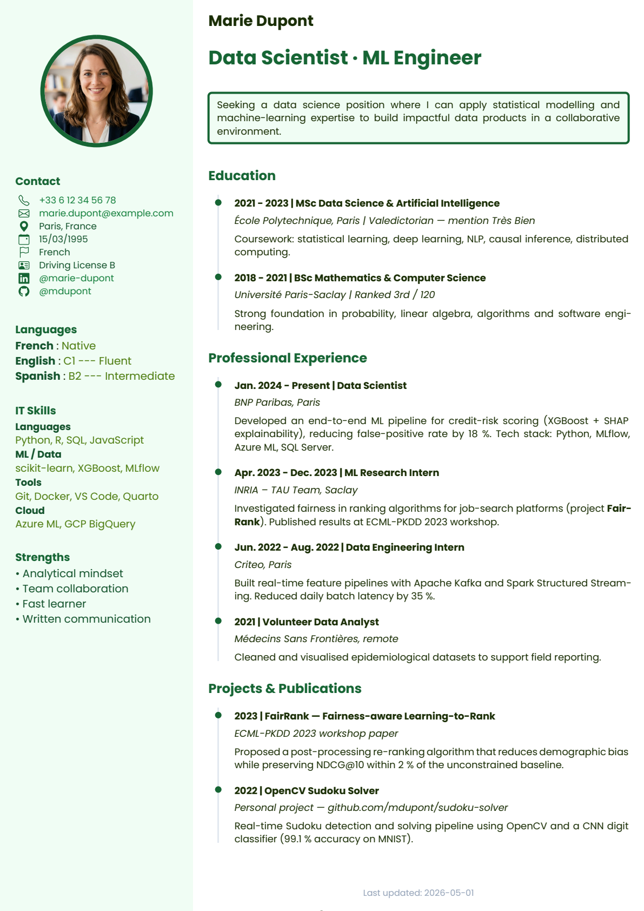
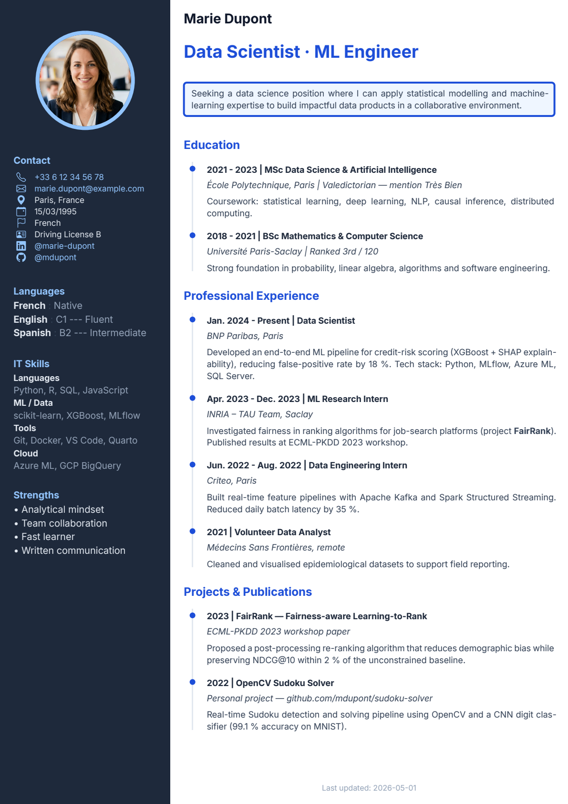
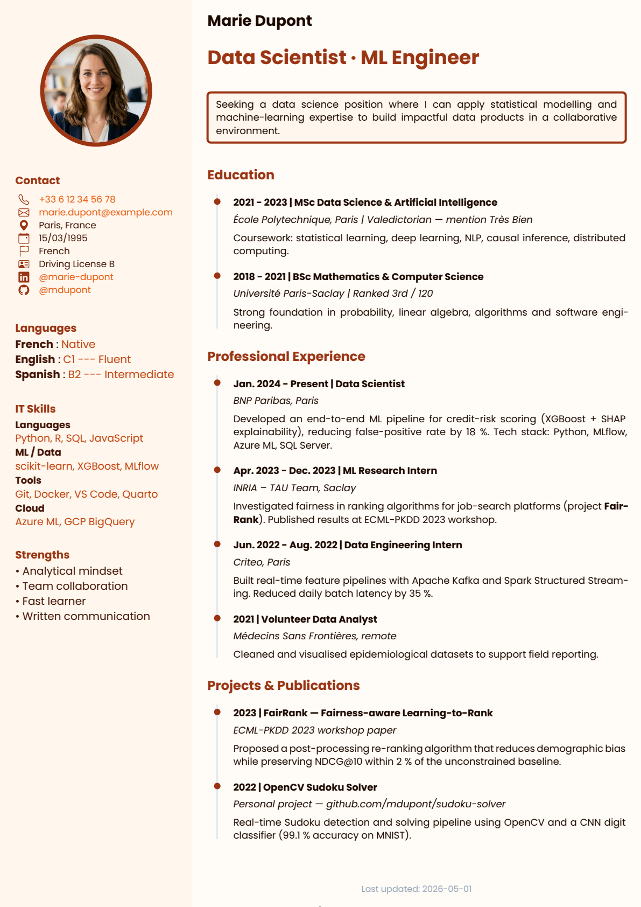

# CV Quarto Template

> A Quarto extension to generate a polished, two-column PDF résumé using Typst — fully configurable via YAML, no Typst knowledge required.


*Extension by [Valentin Goupille](https://www.valentingoupille.com) — free to use, modify and distribute under the [CC BY 4.0 License](LICENSE).*

---

## Theme Gallery

Four ready-to-use themes are bundled — switch with a single line in your frontmatter.

<table>
<tr>
  <td align="center" width="50%">
    <br>
    <b>Classic Blue</b> — professional blue, light sidebar (default)
  </td>
  <td align="center" width="50%">
    <br>
    <b>Forest Green</b> — natural green, mint sidebar
  </td>
</tr>
<tr>
  <td align="center" width="50%">
    <br>
    <b>Minimal Dark</b> — high contrast, dark sidebar (Inter font)
  </td>
  <td align="center" width="50%">
    <br>
    <b>Warm Terracotta</b> — earthy terracotta, sand sidebar
  </td>
</tr>
</table>

Activate a theme with one line:

```yaml
metadata-files:
  - themes/classic-blue.yml    # blue professional (default)
# - themes/forest-green.yml    # natural green
# - themes/minimal-dark.yml    # dark sidebar
# - themes/warm-terracotta.yml # earthy terracotta
```

---

## Features

- **Two-column layout** — configurable sidebar (width, background, gutter) + main content area
- **Modular sidebar** — add, remove, and reorder sections entirely from YAML
- **4 theme presets** — switch with one line (`classic-blue`, `forest-green`, `minimal-dark`, `warm-terracotta`)
- **Full theme system** — fonts, colors, and heading sizes all controlled via YAML
- **Timeline sections** — visual dot/line indicators for education and experience entries
- **SVG icons** — auto-colorized contact icons (phone, email, LinkedIn, GitHub, location…)
- **Native Quarto syntax** — callouts, tables, figures, multi-column blocks all work out of the box
- **Auto date** — `last-modified` or a fixed date with a customizable prefix
- **Auto-named PDF** — output automatically named `CV_FirstName_LastName_YYYY-MM-DD.pdf` via a post-render script
- **Auto-compressed PDF** — the named PDF is compressed automatically with `pikepdf` (no external tool required)

---

## Installation

**Option 1 — Full template** (recommended for a new CV):

```bash
quarto use template vgoupille/quarto-cv
```

This copies `template.qmd`, `assets/`, and installs the extension.

**Option 2 — Extension only** (add to an existing project):

```bash
quarto add vgoupille/quarto-cv
```

Then set `format: quarto-cv-typst: default` in your document frontmatter.

---

## Quick Start

```bash
quarto render template.qmd
```

This produces two files:

- `template.pdf` — always up-to-date preview (tracked in git)
- `CV_FirstName_LastName_YYYY-MM-DD.pdf` — the shareable export, named from the `author` field and today's date

Both steps are handled automatically by `scripts/rename_output.py` and `scripts/compress_pdf.py` via `_quarto.yml` post-render hooks — no manual step required.

---

## Preview Image Generation

The `assets/img/preview.png` shown above is generated from the rendered PDF using a small Python script (`scripts/convert_preview.py`). It uses [**uv**](https://docs.astral.sh/uv/) — a fast Python package manager — to run the script in an isolated environment without requiring any manual `pip install`.

The PDF rendering is handled by [`pypdfium2`](https://pypdfium2.readthedocs.io/), which bundles the PDFium engine directly in its Python wheel — **no system-level dependency required**.

**To regenerate the preview after updating your CV:**

```bash
# 1. Render the CV to PDF (also auto-generates and compresses CV_Name_Date.pdf)
quarto render template.qmd

# 2. Convert the first page to PNG
uv run scripts/convert_preview.py

# 3. Re-render the README
quarto render README.qmd
```

**To regenerate all theme gallery previews** (after modifying a theme or the example CV):

```bash
uv run scripts/generate_gallery.py
```

This renders `example.qmd` once per theme, converts the first page to PNG, and saves each result to `assets/img/preview-{theme}.png`. Intermediate Typst files are cleaned up automatically.

**Requirements:**

- [uv](https://docs.astral.sh/uv/getting-started/installation/) — install with `curl -LsSf https://astral.sh/uv/install.sh | sh`

The Python dependencies (`pypdfium2`, `pyyaml`, `pikepdf`) are declared in `pyproject.toml` and installed automatically by `uv run` on first use — no virtual environment setup needed.

---

## Complete YAML Reference

### Document Metadata

```yaml
title: "CV - First Name Last Name"
author: "First Last"              # used to name the output PDF
date: last-modified               # or a fixed date: "2026-01-01"
date-prefix: "Last updated: "    # leave "" to hide
```

The `author` field drives the automatic PDF filename: `CV_First_Last_YYYY-MM-DD.pdf`. If `date` is set to a specific ISO date (e.g. `2026-01-15`), that date is used; otherwise the render date is used.

---

### Sidebar Data

All contact fields are optional. Omit any field to hide it from the sidebar.

```yaml
sidebar:
  photo: "assets/img/photo.png"      # local path
  phone: "XX XX XX XX XX"
  email: "user@example.com"
  birthdate: "DD/MM/YYYY"
  city: "City, Country"
  nationality: "Nationality"
  permit: "Driving License B"
  website: "https://example.com"
  website-display: "My Website"      # optional custom label
  linkedin: "https://linkedin.com/in/username"
  linkedin-display: "\\@username"    # optional custom label
  github: "https://github.com/username"
  github-display: "\\@username"      # optional custom label
```

| Field | Type | Description |
|---|---|---|
| `photo` | path | Profile photo (local file) |
| `phone` | string | Phone number |
| `email` | string | Email address |
| `birthdate` | string | Date of birth |
| `city` | string | City, Country |
| `nationality` | string | Nationality |
| `permit` | string | Driving license |
| `website` | URL | Personal website |
| `website-display` | string | Custom label for the website link |
| `linkedin` | URL | LinkedIn profile URL |
| `linkedin-display` | string | Custom label (e.g. `\\@handle`) |
| `github` | URL | GitHub profile URL |
| `github-display` | string | Custom label (e.g. `\\@handle`) |

---

### Theme Presets

Four ready-to-use themes are bundled in the `themes/` directory. Activate one by adding a single line to your frontmatter:

```yaml
metadata-files:
  - themes/classic-blue.yml    # blue professional (default)
# - themes/forest-green.yml    # natural green
# - themes/minimal-dark.yml    # dark sidebar
# - themes/warm-terracotta.yml # earthy terracotta
```

| Theme | Primary color | Sidebar background | Font |
|---|---|---|---|
| `classic-blue` | `#2563eb` | `#f1f5f9` (light gray) | Poppins |
| `forest-green` | `#166534` | `#f0fdf4` (mint) | Poppins |
| `minimal-dark` | `#f8fafc` (light text) | `#1e293b` (dark) | Inter |
| `warm-terracotta` | `#9a3412` | `#fff7ed` (sand) | Poppins |

Each preset sets `cv-theme`, `sidebar-defaults`, and `cv-layout` to consistent values. Any key you define in your document's own `cv-theme:` block overrides the preset for that key only.

---

### Theme (manual)

```yaml
cv-theme:
  main-font: "Poppins"         # global font
  title-font: "Poppins"        # font for sidebar section titles
  text-font: "Poppins"         # font for sidebar body text

  sidebar:
    title-color: "#2563eb"     # section title color + photo border
    text-color: "#1e293b"      # main text color
    accent-color: "#64748b"    # secondary items color
    link-color: "#2563eb"      # link color

  main:
    title-color: "#2563eb"     # H1 color (section headings)
    subtitle-color: "#1e293b"  # H2 color (position, degree)
    text-color: "#1e293b"      # body text color
    link-color: "#2563eb"      # body link color (optional)

  headings:
    h1: 14pt     # section titles (Education, Experience…)
    h2: 11pt     # position / degree title
    h3: 10pt     # company / institution / dates
    normal: 10pt # body text
```

---

### Sidebar Defaults

Global spacing applied to all sidebar sections unless overridden per section.

```yaml
sidebar-defaults:
  text-size: 9pt
  title-size: 11pt
  icon-size: 11pt
  title-after: 1em     # space below the section title
  item-after: 1em      # space below each item
  section-after: 3em   # space below the entire section
```

---

### Sidebar Sections

The `sidebar-sections` list controls which sections appear and in what order. Each section has an `id`, an optional `title`, an `items` list, and an optional `style` block.

```yaml
sidebar-sections:
  - id: photo
  - id: contact
  - id: languages
  - id: strengths
  - id: interests
  - id: skills
```

#### Built-in section IDs

These IDs have pre-registered style slots in the template (useful for `sidebar-styles` overrides):

| ID | Purpose |
|---|---|
| `photo` | Profile photo (special renderer) |
| `contact` | Contact info items (`type:` items) |
| `networks` | Social links (`type:` items) |
| `languages` | Language / level pairs |
| `skills` | Skill categories |
| `strengths` | Plain text list |
| `interests` | Nested interest groups |

Any other `id` also works — it uses the generic renderer automatically.

#### Photo section

```yaml
- id: photo
  style:
    photo-size: 100pt
    photo-radius: 50%          # circular crop
    photo-border: true
    photo-border-width: 4pt
    section-before: 2em
    section-after: 3em
```

#### Item types

**`type:` — contact field** (pulls value from `sidebar:` data):

```yaml
items:
  - type: phone
  - type: email
  - type: birthdate
  - type: city
  - type: nationality
  - type: permit
  - type: website
  - type: linkedin
  - type: github
```

**`name` + `value` — key/value pair** (languages, certifications…):

```yaml
items:
  - name: "English"
    value: "Fluent"
  - name: "French"
    value: "Native"
```

**`name` + `subitems` — nested list** (interests, hobbies…):

```yaml
items:
  - name: "Sport"
    subitems:
      - "Running"
      - "Judo"
  - name: "Science"
    subitems:
      - "Genetics"
      - "AI & Health"
```

**`category` + `items` — inline category group** (IT skills…):

```yaml
items:
  - category: "Languages"
    items: "Python, R, Bash"
  - category: "Tools"
    items: "Git, Docker, HPC"
```

**Plain string — free text**:

```yaml
items:
  - "Visit my website for more details."
  - type: website
```

#### Per-section style overrides

Any section can override the global `sidebar-defaults` via a `style:` block. All properties are optional.

**Spacing**

| Property | Example | Description |
|---|---|---|
| `section-before` | `2em` | Space above the section |
| `section-after` | `3em` | Space below the section |
| `title-after` | `0.5em` | Space between the title and first item |
| `item-after` | `1em` | Space between items |

**Typography**

| Property | Example | Description |
|---|---|---|
| `text-size` | `9pt` | Item text size |
| `title-size` | `11pt` | Section title size |
| `text-font` | `"Inter"` | Item font family |
| `title-font` | `"Poppins"` | Title font family |

**Colors & icons**

| Property | Example | Description |
|---|---|---|
| `icon-color` | `"#ff9500"` | Icon color (overrides theme) |
| `icon-size` | `11pt` | Icon size |
| `item-color` | `"#1e293b"` | Item text color |
| `subitem-color` | `"#64748b"` | Sub-item text color |
| `category-color` | `"#2563eb"` | Category label color (skills) |
| `category-size` | `9pt` | Category label size (skills) |
| `category-weight` | `"semibold"` | Category label weight — `"thin"`, `"light"`, `"regular"`, `"medium"`, `"semibold"`, `"bold"`, `"extrabold"` |

**Photo section only**

| Property | Example | Description |
|---|---|---|
| `photo-size` | `100pt` | Photo diameter |
| `photo-radius` | `50%` | Border radius (`50%` = circle) |
| `photo-border` | `true` / `false` | Show/hide border |
| `photo-border-width` | `4pt` | Border thickness |

```yaml
- id: contact
  title: "Contact"
  items:
    - type: phone
    - type: email
  style:
    item-after: 0em
    section-after: 3em
    title-size: 12pt
    text-size: 9pt
    icon-size: 10pt
    # icon-color: "#ff9500"  # override icon color for this section
```

---

### Layout

```yaml
cv-layout:
  sidebar-width: 30%       # left column width (%, cm, or fr)
  main-width: 2.5fr        # right column width
  gutter: 1cm              # space between columns
  sidebar-bg: "#f1f5f9"   # sidebar background color
  main-bg: "#ffffff"       # main area background color
  margins:
    top: 0.5cm
    bottom: 0.5cm
    left: 0.5cm
    right: 0.5cm
  timeline:
    dot-size: "2pt"
    line-width: "1pt"
    # dot-color: "#2563eb"   # optional color override
    # line-color: "#2563eb"  # optional color override
```

---

## Body Content

### Name, Title & Objective

Define your name, job title and objective directly in the YAML front matter — no raw Typst required.
Colors automatically inherit from the active theme and update when you switch themes.

```yaml
cv-header:
  name: "First Name Last Name"
  title: "Job Title or Research Position"
  objective: >-
    Your professional goal. Describe your background, motivations
    and what you are looking for in 2-3 sentences.
  # Optional overrides (theme defaults apply if omitted):
  # name-color: "#000000"
  # name-size: "14pt"
  # title-color: "#2563eb"           # defaults to cv-theme.main.title-color
  # title-size: "18pt"
  # objective-bg: "#f1f5f9"          # defaults to cv-layout.sidebar-bg
  # objective-stroke-color: "#2563eb"# defaults to cv-theme.main.title-color
  # objective-stroke-width: "2pt"
```

| Field | Default | Description |
|---|---|---|
| `name` | — | Full name (bold, large) |
| `title` | — | Job title or position (bold, accent color) |
| `objective` | — | Short paragraph shown in a styled block |
| `name-color` | `main.text-color` | Name text color |
| `name-size` | `14pt` | Name font size |
| `title-color` | `main.title-color` | Title color (inherits from theme) |
| `title-size` | `18pt` | Title font size |
| `objective-bg` | `sidebar-bg` | Objective block background |
| `objective-stroke-color` | `main.title-color` | Objective block border color |
| `objective-stroke-width` | `2pt` | Objective block border width |

Theme-level defaults for these colors can also be set under `cv-theme.header` in a theme
file or in your document's YAML (overrides the theme file, overridden by `cv-header` above):

```yaml
cv-theme:
  header:
    name-color: "#0f172a"
    title-color: "#2563eb"
    objective-bg: "#eff6ff"
    objective-stroke-color: "#2563eb"
    objective-stroke-width: "2pt"
```

Fallback chain for each color/size:
`cv-header.*` (per-doc) → `cv-theme.header.*` (per-theme) → computed theme default

### Timeline Sections

Wrap any section in `.timeline` to add dot/line indicators next to headings:

```markdown
# Education

::: {.timeline}

## YYYY – YYYY | Degree Title

*Institution, City | Grade*

Description of the program.

:::
```

**Heading level conventions inside `.timeline`:**

| Level | Purpose | Example |
|---|---|---|
| `#` (H1) | Section title | `# Education` |
| `##` (H2) | Entry title | `## MSc Bioinformatics` |
| `###` (H3) | Entry detail | `### University of X, 2024` |

### Callouts

Native Quarto callout blocks are fully supported:

```markdown
::: {.callout-note}
This is a note.
:::

::: {.callout-tip}
A helpful tip.
:::

::: {.callout-warning}
Pay attention to this.
:::
```

Available types: `callout-note`, `callout-tip`, `callout-warning`, `callout-important`, `callout-caution`.

### Multi-column Body Content

```markdown
::: {.columns}

::: {.column width="50%"}
Left content here.
:::

::: {.column width="50%"}
Right content here.
:::

:::
```

---

## Lua Filters

Two Pandoc Lua filters run automatically during rendering.

---

### `icons.lua`

Reads the SVG icon files from `icons/` relative to the filter's own location — avoiding path resolution issues between the dev namespace (`_extensions/quarto-cv/`) and the installed namespace (`_extensions/vgoupille/quarto-cv/`). The SVG content is escaped and injected as Typst string metadata (`$cv-icons.phone$`, etc.), which the template uses to render and colorize icons at compile time.

---

### `timeline.lua`

Wraps `::: {.timeline}` divs into a `#timeline-section()` Typst call, which draws a vertical line with dots aligned to heading levels.

**Basic usage:**

```markdown
::: {.timeline}

## 2022 – 2024 | Position Title

*Organization, City*

Description of the role.

:::
```

**Advanced — restrict dots to specific heading levels:**

By default all heading levels (H1–H6) inside the block receive a dot. Use the `levels` attribute to target only certain levels:

```markdown
::: {.timeline levels="2,3"}

## Entry title          ← gets a dot
### Entry detail        ← gets a dot
#### Sub-detail         ← no dot

:::
```

**What the filter produces (Typst):**

```typst
#timeline-section(levels: (2,3,))[
  // your content
]
```

The `timeline-section` function and its dot/line styling are defined in `template.typ` and configurable via `cv-layout.timeline` in the YAML.


---

## Project Structure

```
your-cv/
├── template.qmd              # Your CV document (edit this)
├── _quarto.yml               # Project config — triggers post-render scripts
├── pyproject.toml            # Python deps (pypdfium2, pyyaml, pikepdf) for uv
├── example.qmd               # Filled-in example CV (Marie Dupont) — gallery source
├── scripts/
│   ├── rename_output.py      # Post-render: copies <name>.pdf → CV_Name_Date.pdf
│   ├── compress_pdf.py       # Post-render: compresses CV_Name_Date.pdf (pikepdf)
│   ├── convert_preview.py   # Converts <name>.pdf → assets/img/preview.png
│   └── generate_gallery.py  # Renders example.qmd per theme → assets/img/preview-{theme}.png
├── assets/
│   └── img/
│       └── photo.png         # Your profile photo
├── themes/
│   ├── classic-blue.yml      # Theme preset: blue professional (default)
│   ├── forest-green.yml      # Theme preset: natural green
│   ├── minimal-dark.yml      # Theme preset: dark sidebar
│   └── warm-terracotta.yml   # Theme preset: earthy terracotta
├── _extensions/
│   └── quarto-cv/
│       ├── _extension.yml      # Extension metadata
│       ├── typst-template.typ  # Typst function definitions (cv layout engine)
│       ├── typst-show.typ      # Pandoc template — wires YAML metadata to cv()
│       ├── brand.yml           # Typography defaults (Quarto brand schema)
│       ├── icons.lua           # SVG icon injection Lua filter
│       ├── timeline.lua        # Timeline Lua filter
│       ├── fonts/              # Bundled Poppins & Inter TTF fonts
│       └── icons/              # SVG contact icons (Bootstrap Icons)
└── template.pdf              # Latest render (preview — tracked in git)
```

---

## Requirements

- [Quarto](https://quarto.org) ≥ 1.4
- Typst (bundled with Quarto ≥ 1.4, no separate install needed)

The fonts **Poppins** and **Inter** are bundled inside the extension — no system installation required. Any other font can be used by installing it on the system and setting `main-font` in `cv-theme`.

---

## Contributing

Contributions are welcome! Feel free to open an issue or submit a pull request for bug fixes, new features, or improvements.

```bash
# Fork the repo, then:
git clone https://github.com/your-username/quarto-cv.git
cd quarto-cv
quarto render template.qmd   # test your changes
```

This project is released under the [CC BY 4.0 License](LICENSE) — you are free to use, modify and distribute it, including for commercial purposes, as long as you credit the original author.
